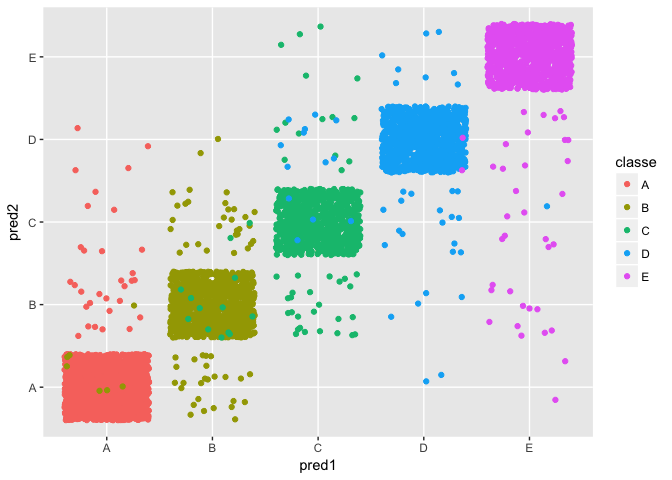
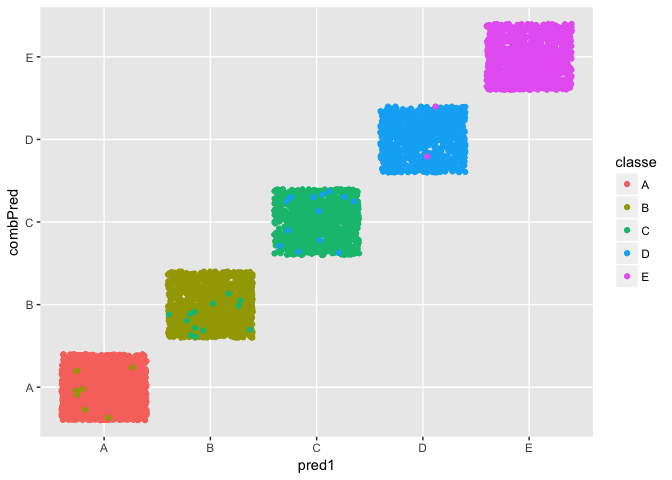

### Executive Summary

The following analysis is done on the Weight Lifting Exercise Dataset (Velloso, E.; Bulling, A.; Gellersen, H.; Ugulino, W.; Fuks, H. Qualitative Activity Recognition of Weight Lifting Exercises. Proceedings of 4th International Conference in Cooperation with SIGCHI (Augmented Human '13) . Stuttgart, Germany: ACM SIGCHI, 2013.). The data had been gathered from accelerometers on the belt, forearm, arm, and dumbbell of 6 participants.

The following Course Project predicts the manner in which the exercise was performed, i.e. the "classe" variable, with five categories. The current report describes how the prediction model was built, the way cross-validation was used, as well as in the sample and out of sample error estimates.

### Analysis

First, we load the data sets from the urls that were provided in the assignment. We need to specify that all blank cells within the training set need to be replaced with NA values.


```r
fileUrl <- "https://d396qusza40orc.cloudfront.net/predmachlearn/pml-training.csv"
download.file(fileUrl, destfile = "pml-training.csv", method = "curl")

dataTraining <- read.csv("pml-training.csv", header = TRUE, na.strings = c("", "NA"))

fileUrl2 <- "https://d396qusza40orc.cloudfront.net/predmachlearn/pml-testing.csv"
download.file(fileUrl2, destfile = "pml-testing.csv", method = "curl")

dataTesting <- read.csv("pml-testing.csv")
```

Next, let's look at the structure and the summary of the training data set, in order to get beter understanding of the variables and assume the most appropriate cross-validation approach.


```r
str(dataTraining)
summary(dataTraining$classe)
```

As a next step, we need to perform data slicing and split the training data set to training and testing sets. We will use the new training set to build the model, the testing set to test and fine tune it. At the end, we will use the original testing set, as provided in the project, to predict only once and calculate our out of sample error. We will use the caret package for data slicing and model fitting.


```r
library(caret)

inTrain <- createDataPartition(y = dataTraining$classe, p = 0.7, list = FALSE)

training <- dataTraining[inTrain, ]
testing <- dataTraining[-inTrain, ]
```

Next, we need to explore the data and find the best predictors, before we decide on the appropriate prediction model.


```r
summary(training)
```

First, let's check the proportion of missing values within each variable. We may need to establish a treshold for dimenshion reduction due to a large amount of missing data.


```r
propmiss <- function(dataframe) {
        m <- sapply(dataframe, function(x) {
                data.frame(n=length(x),
                           nmiss=sum(is.na(x)),
                           propmiss=sum(is.na(x))/length(x))
        })
        d <- data.frame(t(m))
        d <- sapply(d, unlist)
        d <- as.data.frame(d)
        d$variable <- row.names(d)
        row.names(d) <- NULL
        d <- cbind(d[ncol(d)],d[-ncol(d)])
        return(d[order(d$propmiss), ])
}

missVal <- propmiss(training)

## Note: Function by Stephen Turner (article: "Summarize Missing Data for all Variables in a Data Frame in R", article url: http://www.gettinggeneticsdone.com/2011/02/summarize-missing-data-for-all.html).

round(missVal$propmiss, digits = 2)
```

```
##   [1] 0.00 0.00 0.00 0.00 0.00 0.00 0.00 0.00 0.00 0.00 0.00 0.00 0.00 0.00
##  [15] 0.00 0.00 0.00 0.00 0.00 0.00 0.00 0.00 0.00 0.00 0.00 0.00 0.00 0.00
##  [29] 0.00 0.00 0.00 0.00 0.00 0.00 0.00 0.00 0.00 0.00 0.00 0.00 0.00 0.00
##  [43] 0.00 0.00 0.00 0.00 0.00 0.00 0.00 0.00 0.00 0.00 0.00 0.00 0.00 0.00
##  [57] 0.00 0.00 0.00 0.00 0.98 0.98 0.98 0.98 0.98 0.98 0.98 0.98 0.98 0.98
##  [71] 0.98 0.98 0.98 0.98 0.98 0.98 0.98 0.98 0.98 0.98 0.98 0.98 0.98 0.98
##  [85] 0.98 0.98 0.98 0.98 0.98 0.98 0.98 0.98 0.98 0.98 0.98 0.98 0.98 0.98
##  [99] 0.98 0.98 0.98 0.98 0.98 0.98 0.98 0.98 0.98 0.98 0.98 0.98 0.98 0.98
## [113] 0.98 0.98 0.98 0.98 0.98 0.98 0.98 0.98 0.98 0.98 0.98 0.98 0.98 0.98
## [127] 0.98 0.98 0.98 0.98 0.98 0.98 0.98 0.98 0.98 0.98 0.98 0.98 0.98 0.98
## [141] 0.98 0.98 0.98 0.98 0.98 0.98 0.98 0.98 0.98 0.98 0.98 0.98 0.98 0.98
## [155] 0.98 0.98 0.98 0.98 0.98 0.98
```

```r
sum(missVal$propmiss > 0.9)
```

```
## [1] 100
```

62.5% of the variables, or 100 out of 160, have over 90% missing values within them. The rest of the 60 variables have 0% missing values. Theoretically, variables with over 20%-30% missing data can be excluded from the data set. With that said, we can set our treshold to 90%, which can exlude 100 variables from our data set, and exclude them as predictor variables when building the prediction model.

Going furhter, let's start with our dimensionality reduction, by singling out the variables with missing values above 90%.


```r
varNoNa <- missVal$variable[missVal$propmiss < 0.9]

training2 <- subset(training, select = varNoNa)

str(training2)
summary(training2)
```

Next, let's check for variables with near zero variance, which is an indicator for a non-informative predictor variable.


```r
nearZeroVar(training2, names = TRUE)
summary(training2$new_window)
```

As it turned out, the "new_window" variable is a near zero variable, so let's remove it from the training data set, as a possible predictor.


```r
training3 <- training2[, -6]

str(training3)
```

Next, let's use some domain knowledge and continue with our dimention reduction. Going further, to predict exercise quality, or the "classe" variable, based on the various measurements collected, we can assume that the variables "X", "user_name", "raw_timestamp_part_1", "raw_timestamp_part_2", "cvtd_timestamp", and "num_window" will not be useful. With that said, let's remove them from our training data set.


```r
training4 <- training3[, -c(1:6)]

str(training4)
```

After cleaning the data of the variables that will not be good predictors, let's run a model using Random Forests.

First, we configure the trainControl object. We use K-fold cross-validation. We substitute the default boostrapping with K-fold in order to reduce the number of sampling from 25 to 5 folds, and reduce computation power.


```r
fitControl <- trainControl(method = "cv",
                           number = 5,
                           allowParallel = TRUE)
```

Next, we develop the training model.


```r
modFit <- train(classe ~ ., method = "rf", data = training4, trControl = fitControl)
```

Once we have our model fit, we can check its accuracy.


```r
modFit
modFit$resample
```

```r
confusionMatrix.train(modFit)
```

```
## Cross-Validated (5 fold) Confusion Matrix 
## 
## (entries are percentual average cell counts across resamples)
##  
##           Reference
## Prediction    A    B    C    D    E
##          A 28.4  0.2  0.0  0.0  0.0
##          B  0.0 19.1  0.3  0.0  0.0
##          C  0.0  0.1 17.2  0.3  0.0
##          D  0.0  0.0  0.0 16.1  0.0
##          E  0.0  0.0  0.0  0.0 18.3
##                             
##  Accuracy (average) : 0.9905
```

With this model we achieved an Accuracy average of 0.9905, which makes an in the sample error of 0.0095 (or 1 - 0.9905).

Next, let's make a table of the predictions from our model, predicting on the testing set (as part of the training set), and see how accurately we can predict with it.


```r
pred1 <- predict(modFit, testing)

testing1 <- testing
testing1$predRight1 <- pred1 == testing1$classe
table(pred1, testing1$classe)
```

```
##      
## pred1    A    B    C    D    E
##     A 1674    7    0    0    0
##     B    0 1129   13    0    0
##     C    0    3 1012   13    0
##     D    0    0    1  950    2
##     E    0    0    0    1 1080
```

Going furhter, we will apply model ensembling to improve the accuracy of our model. First, we will fit a second model, or boosting with trees (method = "gbm"). We will measure its performance and combine the two models in a third one, for even better prediction.


```r
modFit2 <- train(classe ~ ., method = "gbm", data = training4, verbose = FALSE)
```

Once we have our model fit, we can check its accuracy.


```r
modFit2
modFit2$resample
```

```r
confusionMatrix.train(modFit2)
```

```
## Bootstrapped (25 reps) Confusion Matrix 
## 
## (entries are percentual average cell counts across resamples)
##  
##           Reference
## Prediction    A    B    C    D    E
##          A 27.9  0.7  0.0  0.0  0.0
##          B  0.3 18.3  0.6  0.1  0.3
##          C  0.1  0.4 16.5  0.6  0.2
##          D  0.0  0.0  0.2 15.5  0.3
##          E  0.0  0.0  0.0  0.2 17.5
##                             
##  Accuracy (average) : 0.9576
```

With this model we achieved an Accuracy average of 0.9576, which makes an in the sample error of 0.0424 (or 1 - 0.9576).

Again, let's make a table of the predictions from our model, predicting on the testing set (as part of the training set), and see how accurately we can predict with it.


```r
pred2 <- predict(modFit2, testing)

testing2 <- testing
testing2$predRight2 <- pred2 == testing2$classe
table(pred2, testing2$classe)
```

```
##      
## pred2    A    B    C    D    E
##     A 1643   32    0    2    2
##     B   20 1073   37    4   11
##     C    7   32  973   21    9
##     D    4    2   11  929   15
##     E    0    0    5    8 1045
```

Next, as the plot of the two predictors against each other shows, they overlap, but do not exactly match. In other words, we need to furhter improve our prediction model.


```r
qplot(pred1, pred2, colour = classe, data = testing, geom = "jitter")
```

<!-- -->

As a next step, we fit a model that combines the two predictors. First, we create a new data set consisted of the predictions from the two models, then we create a "classe" variable, which is the "classe" variable from the testing data set. Finally, we fit the combined model, which will have the "classe" variable as the outcome and the two prediction variables as the predictor variables.


```r
predDF <- data.frame(pred1, pred2, classe = testing$classe)
combModFit <- train(classe ~ ., ethod = "gam", data = predDF)
```

Once we have our model fit, we can check its accuracy.


```r
combModFit
combModFit$resample
```

```r
confusionMatrix.train(combModFit)
```

```
## Bootstrapped (25 reps) Confusion Matrix 
## 
## (entries are percentual average cell counts across resamples)
##  
##           Reference
## Prediction    A    B    C    D    E
##          A 28.5  0.1  0.0  0.0  0.0
##          B  0.0 19.1  0.2  0.0  0.0
##          C  0.0  0.0 17.2  0.2  0.0
##          D  0.0  0.0  0.1 16.1  0.0
##          E  0.0  0.0  0.0  0.0 18.3
##                             
##  Accuracy (average) : 0.9924
```

With this combined model we achieved an Accuracy average of 0.9924, which makes an in the sample error of 0.0076 (or 1 - 0.9924), which is the highest accuracy level and the lowest in the sample error of the three models so far.

Next, let's make a table of the predictions from our model, predicting on the on the combined data set, and see how accurately we can predict with it.


```r
combPred <- predict(combModFit, predDF)

testingComb <- testing
testingComb$predRightComb <- combPred == testingComb$classe
table(combPred, testingComb$classe)
```

```
##         
## combPred    A    B    C    D    E
##        A 1674    7    0    0    0
##        B    0 1129   13    0    0
##        C    0    3 1012   13    0
##        D    0    0    1  950    2
##        E    0    0    0    1 1080
```

When we compare the three tables with predicted values vs. the real values of the outcome variable "classe", from the testing set (as part of the training set), we can see that the first and the combined models are much more accurate classifiers than the second model. Let's plot them against each other, so we can visualize it better.


```r
qplot(pred1, combPred, colour = classe, data = testing, geom = "jitter")
```

<!-- -->

In terms of the error estimation, an expected ot of sample error can be calculated with 1 - the accuracy of the combined prediction model, raised on the 20 degree "because the probability of the total is equal to the product of the independent probabilities". As the formula below shows, that estimation is 0.108033, or 11%.


```r
expError <- 1 - 0.9943^20
expError
```

```
## [1] 0.108033
```

We can estimate the out of sample error when we predict on the initial testing set, which was provided with the Course Project, since we are required to predict 20 new cases.

Finally, we can use the combined model to predict the 20 new cases, as part of the provided test set. As the method of model enesmbling dictates, we need to fit the first model, then the second one, create a new data frame with the two vectors of predicted values and predic with the combined classifier.


```r
predFinal1 <- predict(modFit, dataTesting)
predFinal2 <- predict(modFit2, dataTesting)

predFinalDF <- data.frame(pred1 = predFinal1, pred2 = predFinal2)

combFinalPred <- predict(combModFit, predFinalDF)
combFinalPred
```

```
##  [1] B A B A A E D B A A B C B A E E A B B B
## Levels: A B C D E
```

### Conclusion

The true out of sample error can be calculated after submitting the quiz, as part of the Course Project, by predicting the 20 cases. In this particular analysis, after using ensembling method, combining Random Forests (used with K-fold cross-validation) with Boosting with trees, all 20 cases were predicted correctly. That made up for 100% accuracy and 0% out of sample error.
